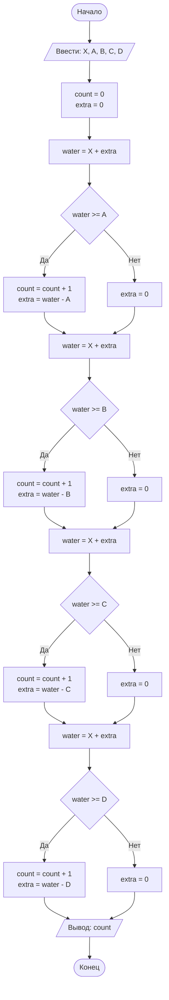

## Отчет по лабораторной работе № 1

#### № группы: `ПМ-2601`

#### Выполнила: `Кулагина Ульяна Юрьевна`

#### Вариант: `№12`

### Cодержание:
- [Постановка задачи](#1-постановка-задачи)
- [Входные и выходные данные](#2-входные-и-выходные-данные)
- [Выбор структуры данных](#3-выбор-структуры-данных)
- [Алгоритм](#4-алгоритм)
- [Программа](#5-программа)
- [Анализ правильности решения](#6-анализ-правильности-решения)
 ### 1. Постановка задачи
>Последовательность из четырех ванночек объемами A, B, C, D литров установлена в указанном порядке ступенькой (объем A — сверху). Ванночки
>установлены таким образом, что если в ванночку наливать воду больше её
>объема, излишки будут стекать в следующую ванночку, установленную ниже (как каскадный водопад). Изначально все ванночки пусты. В каждую
>ванночку выливают воду объемом X литров. Какое количество ванночек
>окажется в результате полностью заполненным? На вход программы подаются натуральные числа X, A, B, C, D.

Данную задачу можно разбить на подзадачи:

- Для первой ванночки (объём A) количество поступившей воды равно X (в неё вылили X литров, сверху ничего не стекало).
- Для каждой следующей ванночки количество поступившей воды равно X (в неё вылили X литров) плюс излишек от предыдущей ванночки.
Для каждой ванночки нужно рассмотреть 2 случая:
- Ванночка заполняется полностью, если количество поступившей в неё воды >= её объема:
  1. Счетчик заполненных ванночек увеличивается на 1.
  2. Количество воды перетекающей в следующую = поступившая вода(Х)-объем ванны
- Ванночка заполняется не полностью, если количество поступившей в неё воды < её объемаЖ
  1. Счетчик заполенных ванночек увеличивается на 0.
  2. Количество воды перетекающей в следующую = 0.

Ванночек всего 4, для каждой по 2 случая, значит всего надо рассмотреть (2*2)*4=16&

### 2. Входные и выходные данные

#### Данные на вход
На вход программа должна получать 5 чисел, при этом в условии не сказано, к какому множеству принадлежат получаемые числа, поэтому будем считать их целыми.

|             | Тип                |
|-------------|--------------------|
| X (Число 1) | Целое число        | 
| A (Число 2) | Целое число        |
| B (Число 3) | Целое число        | 
| C (Число 4) | Целое число        |
| D (Число 5) | Целое число        |

Данные на выход
Программа должна вывести цело число, количество заполненных в итоге ванночек.

|         | Тип                                | min значение | 
|---------|------------------------------------|--------------|
| Число 1 | Целое неотрицательное число | 0            |

### 3. Выбор структуры данных
Программа получает 5 вещественных чисел. Для их хранения нужно выделить 5 переменных('x','a','b','c' и 'd') типа double.

|             | название переменной | Тип (в Java) | 
|-------------|---------------------|--------------|
| X (Число 1) | `x`                 | `int`        |
| A (Число 2) | `a`                 | `int`        | 
| B (Число 3) | `b`                 | `int`        |
| C (Число 4) | `c`                 | `int`        | 
| D (Число 5) | `d`                 | `int`        |

### 4. Алгоритм

#### Алгоритм выполнения программы:
1. Ввод данных: программа считывает 5 чисел, обозначенных как x,a,b,c и d
2. Заводим счетчик заполненных ванночек count = 0 и переменную extra = 0, которая хранит излишки воды 
3. Считается количество поступившей воды в первую ванночку А water = X + extra. Если water >= A, то ванночка заполнена полностью, увеличиваем count на 1. Вычисляем излишек, перетекающий в следующую ванну extra = water - A. Если water < A, то ванночка не заполняется до конца и счетчик не меняется.
4. Аналогично с B water = X + extra. Если water >= B, то ванночка заполнена полностью, count =+ 1. Излишек extra = water - B. Если water < B, ванночка не заполнена, счетчик не меняется.
5. Аналогично с C water = X + extra. Если water >= C, то ванночка заполнена полностью, count =+ 1. Излишек extra = water - C. Если water < C, ванночка не заполнена, счетчик не меняется.
6. Аналогично с D water = X + extra. Если water >= D, то ванночка заполнена полностью, count =+ 1. Излишек extra = water - D. Если water < D, ванночка не заполнена, счетчик не меняется.
7. Вывод результата на экран: счетчик count показывает количество заполненных ванночек.

#### Блок-схема


### 5. Программа

```java
import java.io.PrintStream;
import java.util.Scanner;

public class Main {
// Объявляем объект класса PrintStream для вывода данных
    public static PrintStream out = System.out;
// Объявляем объект класса Scanner для ввода данных
    public static Scanner in = new Scanner(System.in);
    public static void main(String[] args) { {
        int x = in.nextInt(), a = in.nextInt(), b = in.nextInt(), c = in.nextInt(), d = in.nextInt(); //ввод 5 чисел
        int count = 0; //счётчик заполненных ванночек
        int extra = 0; //излишки(изначально их 0)
        int waterA = x + extra; //вода в первой ванночке
//проверка заполненности ванночки
        if (waterA >= a) { 
            count = count + 1;
            extra = waterA - a;
        } else {
            extra = 0;
        }
        int waterB = x + extra; //аналогично поступаем со второй ванночкой, добавляем излишки с прошлой, если есть
        if (waterB >= b){
            count = count + 1;
            extra = waterB - b;
        } else {
            extra = 0;
        } 
        int waterC = x + extra; //аналогично с третьей

        if (waterC >= c) { 
            count = count + 1;
            extra = waterC - c;
        } else {
            extra = 0;
        }

        int waterD = x + extra; // с четвертой тоже:0

        if (waterD >= d) {
            count = count + 1;
            extra = waterD - d;
        } else {
            extra = 0;
        }

        // выводим ответ — сколько ванночек заполнилось полностью
        System.out.println(count);
    }
}
}
```

### 6. Анализ правильности решения
Программа работает корректно со всеми целыми числами.

1. input 5 3 3 3 100, output 3
2. input 400 1000 55 66 100, output 3
3. input 10 20 1 500 6, output 2

